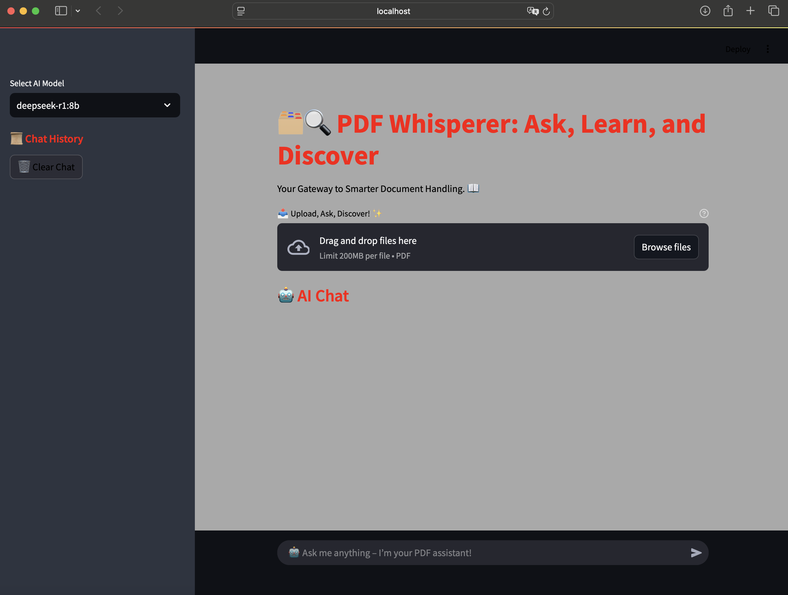
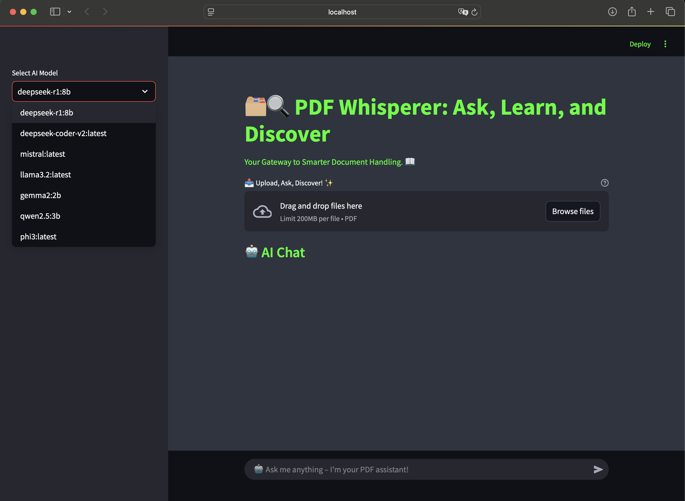
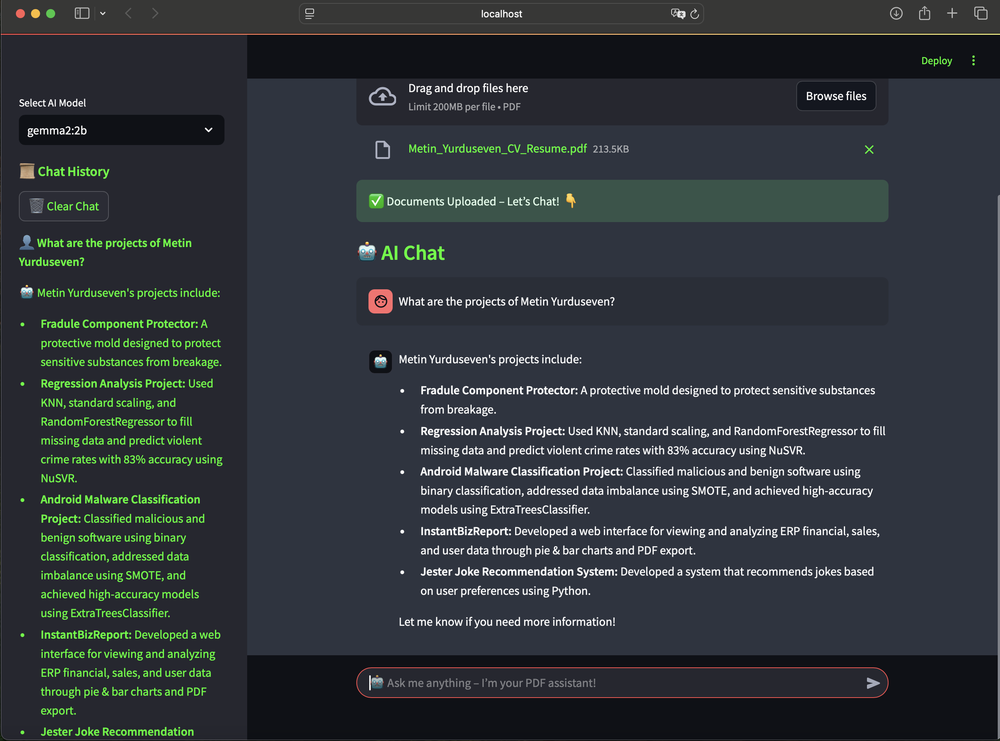

# PDF Multi-Model Rag Chat Bot 📄💬

Welcome to the **PDF Rag Chat Bot** project! 🚀  
This project provides a powerful chat bot that allows users to interact with PDF documents in real-time, using various advanced models for seamless conversation.

### 🌟 Key Features:
- **Multi-Model Support:** Users can select from a variety of cutting-edge models to chat with their PDF documents, including:
  - `deepseek-r1:8b` 
  - `deepseek-coder-v2:latest` 
  - `mistral:latest` 
  - `llama3.2:latest` 
  - `gemma2:2b` 
  - `qwen2.5:3b` 
  - `phi3:latest` 

- **Multiple PDF Uploads:** Upload multiple PDFs and interact with them at once! 📂📑

- **Dark & Light Themes:** Enjoy a user-friendly experience with separate themes for night and day, making it easy to use anytime. 🌙🌞

- **Interactive Sidebar:** Users can select the model of their choice from the sidebar for an optimized experience. 🔧🖱️

---

### 💡 Technologies Used:
- **Langchain**:
  - `langchain-core` 
  - `langchain-community` 
  - `langchain-ollama` 
- **PDF Parsing:** `pdfplumber` 
- **Streamlit for UI**: A great way to interact with the models and PDFs. 🖥️ 

### 📥 Installation:

Clone the repository and install the required dependencies:

```bash
git clone https://github.com/yourusername/pdf-rag-chat-bot.git
cd pdf-rag-chat-bot
pip install -r requirements.txt
```

---

### ⚙️ Run the Application:

To run the application locally:

```bash
streamlit run app.py
```

---

### 🛠️ Libraries & Technologies Icons:

- **Langchain**: 
- **PDFPlumber**: 
- **Streamlit**: 
- **Python**: 

---

### 🎨 Features:
- **User-Friendly Interface**: Easy to navigate and use.
- **Customizable Model Selection**: Quickly switch between models from the sidebar.
- **Responsive Design**: Works seamlessly across devices.

---

### 🖼 İmages:


[](photos/example1.png)

[](photos/example2.png)

[](photos/example3.png)

[](photos/example4.png)

[](photos/example5.png)

---

### 💻 Contribute:

Feel free to fork, clone, and contribute to this project! Please open an issue or submit a pull request if you have suggestions or improvements.

---

## 👨‍💻 Author
**Metin Yurduseven**  
🔗 [GitHub](https://github.com/metinyurdev)  
📧 metin.yurduseven@gmail.com

---

### 📜 License:
This project is licensed under the MIT License - see the [LICENSE](LICENSE) file for details.

---

Thanks for checking out the PDF Multi-Model Rag Chat Bot! Happy chatting! 😊
